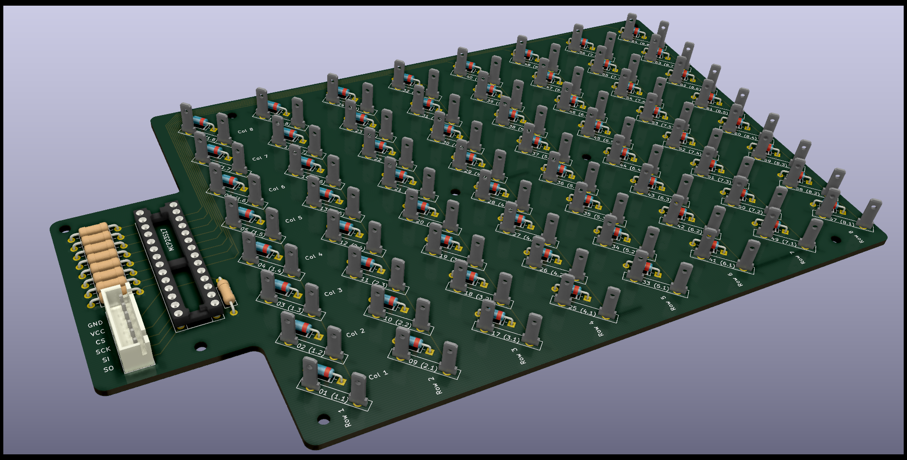

# The Button Matrix PCB

The Button Matrix PCB was created with [KiCAD](https://kicad-pcb.org/). The complete project is downloadable [here](files/ButtonMatrix-Kicad.zip).

Based on the schematics I have created an easy-to-solder PCB (THT instead of SMD):

Some infos about the pcb:
- The diodes are necessary to avoid [keyboard ghosting](https://en.wikipedia.org/wiki/Rollover_(key)#Ghosting)
- The blade terminals may seem to have a lot of space between them. Placing them closer to each other is possible but makes the assembly (or disassembly if necessary) more finicky.

## Bill of materials
-   1 IC socket 28 pin
-   1 IC MCP23S17
-   1 resistor 1k
-   8 resistors 10k
-  64 diodes 1N4148
- 128 blade terminals
-   1 connector JST-XH-6A

## How does it work?
The MCP23S17 has 16 I/O pins. Eight of those (GP<b>A</b>x) are set to output, the other eight (GP<b>B</b>x) to input. The eight input pins are pulled down to ground because otherwise they would be floating (not connected to anything) when the connected button is not pressed or not button is connected at all. In the rendered pcb image above you can see the GP<b>B</b>x pins and their resistors facing to the left and the GP<b>A</b>x on the opposing side of the IC.

The code powers only one of the eight ROWs at a time by setting exactly one of the eight GP<b>A</b>x pins on the MCP23S17 to HIGH. It then scans all eight GP<b>B</b>x pins. For each GPBx pin that measures HIGH it knows that the blade terminals in that ROW and COLumn must be connected -> the button connected to these blade terminals is pushed.

Disclaimer: The files and information given here are for informational purposes only. They have worked for me but I do not give any guarantee that they will work for you. Use them at your own risk.

This work   is licensed under <a rel="license" href="https://creativecommons.org/licenses/by-sa/4.0">CC BY-SA 4.0</a>
