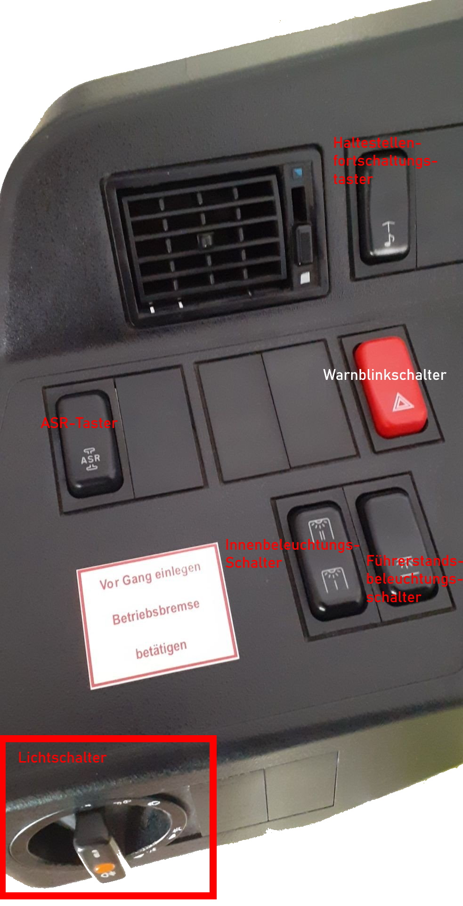
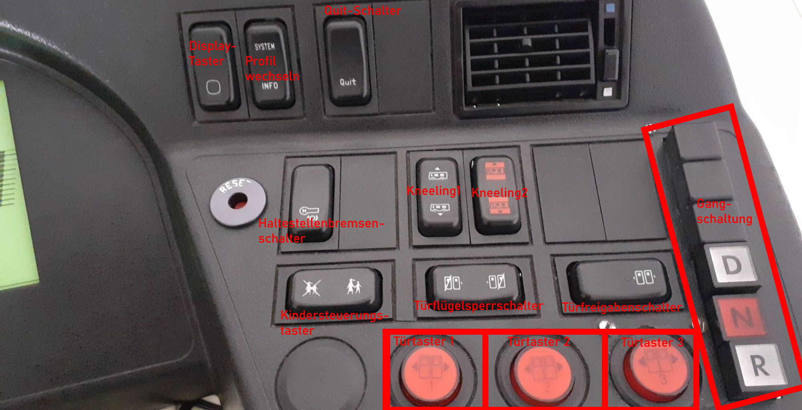
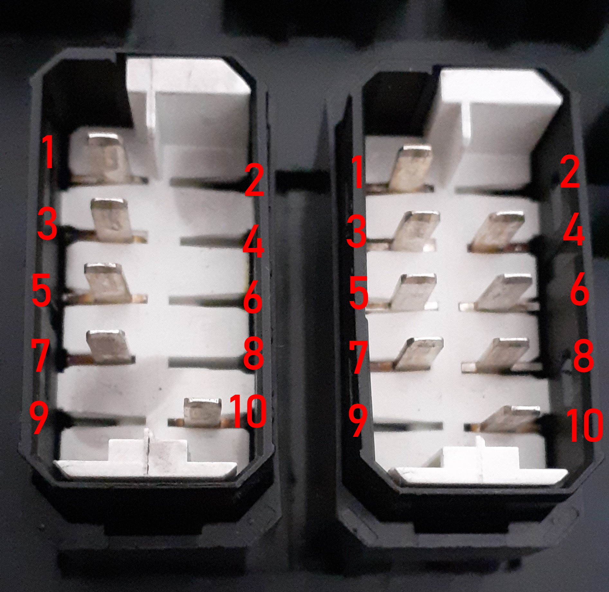

# Bus Dashboard
## User interface

## Buttons
On the Dashboard there are nine different types of buttons.

### Type one: "Kippschalter 1"
1. Switchable in one direction.
2. ON/OFF
3. Can be a switch or a button.

1.  24V+ (light)
2.  not used
3.  Option 2
4.  Option 1
5.  not used
6.  not used
7.  Option 2
8.  Option 1
9.  not used
10. 24V- (light)
