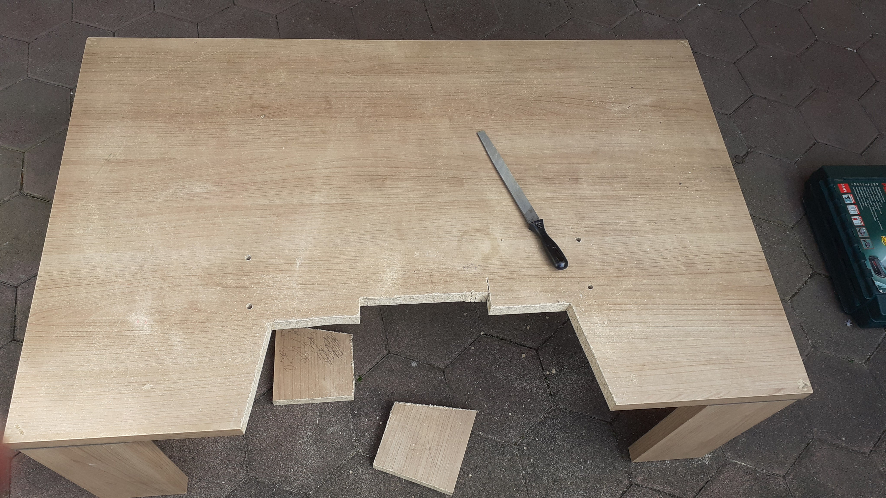
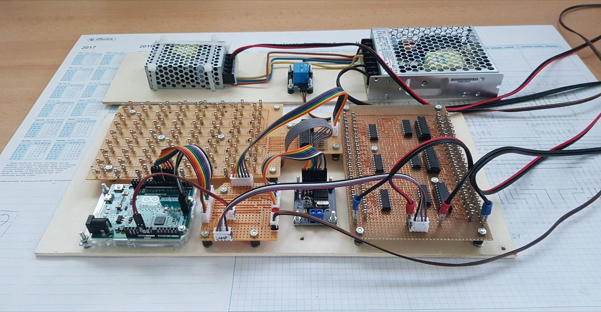
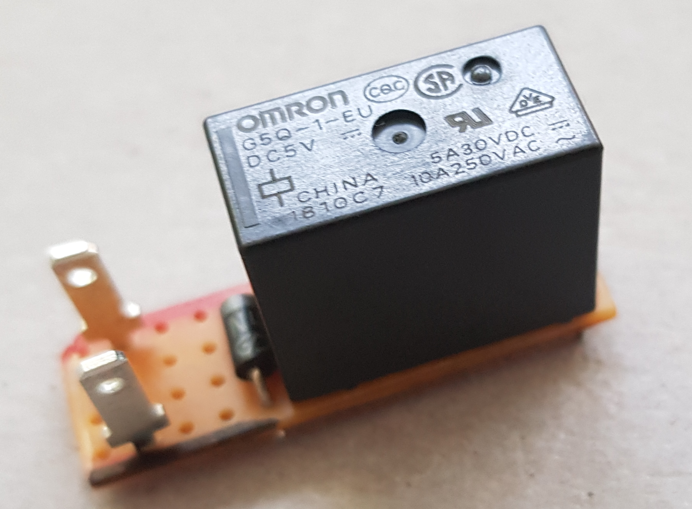

# The goal

The ultimate goal is to use a real bus dashboard that has been stripped from a bus as a controller for the bus simulator software OMSI.

## Getting information from OMSI

This is made possible because of a fan-made dll that links into OMSI called KOMSI. It receives OMSI-internal information, which it in turn sends to a configurable serial port via USB. This is a one way communication, it is only capable of sending information.

Every new frame (each time, a complete screen has been rendered) it sends all information it has gathered in a pretty simple format. So the controller needs to be able to receive the information via serial port from the PC and decode it.

## Controlling and sending information to OMSI

OMSI is controlled by sending keystrokes. The controller obviously needs to be able to send keystrokes to the PC.

## Steering

For steering we want to use a standard commercial force feedback wheel. For that we need to build a (removable) connector between the steering wheel axle and the force feedback wheel. Also we need an adjustable way to attach the force feedback wheel to the dashboard.

# The Bus Dashboard

The dashboard was formerly used in a real bus - it's pretty heavy. To use it safely it was neccessary to build something that holds it relyably in position. The initial idea was to build a frame. We ditched that idea in favor of a much more simple solution: a cheap used sofa table. After stripping off every non-vital part of the dashboard (and thus dropping a considerable amount of weight) we were able to simply attach it to the table with four sturdy screws. To make room for the drivers legs we simply cut out a conveniently sized piece of the table top. Coincidentally the table had just the right height. With the dashboard on top of it, the steering wheel is in a position that needs no further adjusting.

Of course it came without any documentation - so we had to take inventory ourselves, try, fail, learn... The knowledge we gained is documented [here](dashboard/dashboard.md).

# The Dashboard Controller

## Hardware

The controller is based on an [Arduino Leonardo](https://www.arduino.cc/en/Main/Arduino_BoardLeonardo), mostly because it is capable of sending keystrokes to the PC via its USB-connection.

It is connected to two custom pcb that take care of the in- and output of the bus dashboard. The input is mostly "which switch is in what position", "which button is currently pressed", and so on. The pcb is called [buttonmatrix](buttonmatrix/buttonmatrix.md). The output is mainly switching light bulbs and leds on and off. So the pcb is called [lampdriver](lampdriver/lampdriver.md).

The [power supply](powersupply/powersupply.md) needs to provide 24V for lighting most of the stock switches and 5V for a few customized parts on the dashboard. To add a little safety it is controlled by the arduino via a relay. The Arduino itself is independantly powered by the connected PC via USB.

The dashboard of course contains a speed indicator. Just like everthing else it came without any documentation. We also haven't found publicly available documentation on it. What we do know is that it is normally connected to the CANBus on the bus. Therefor we have included a [commercially available CANBus board](https://joy-it.net/en/products/SBC-CAN01) in the setup. Currently it is not used because we still need to figure out what to send to make the speed indicator move. Should that not succeed we'll take apart the speed indicator and modify it using a stepper motor.

To make the connections between arduino and pcbs more robust and to have options when it comes to positioning the new parts inside the dashboard we wanted to use pluggable cables. For that we have created a simple [shield](shield/shield.md) for the Arduino.

Ultimately we wanted to have that crisp sound when the indicator / turn signal is on. To have the real thing, we simply decided on a relay that is glued to the dashboard - the dashboard body is the sound box. It is a 5V relay so we control it using the lampdriver pcb.

A first prototype of the controller:

## Software

An overview is given [here](code/code.md). We have also taken a considerable amount of time to comment the source code. 