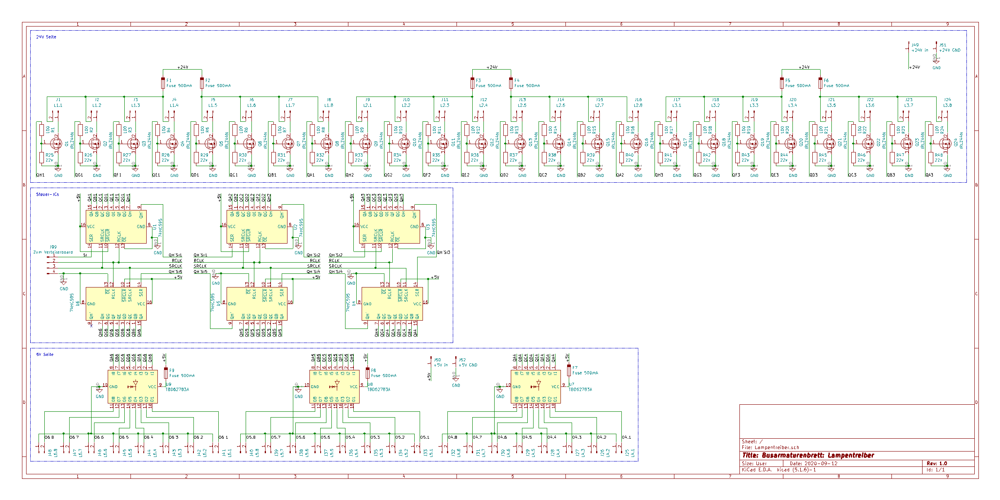
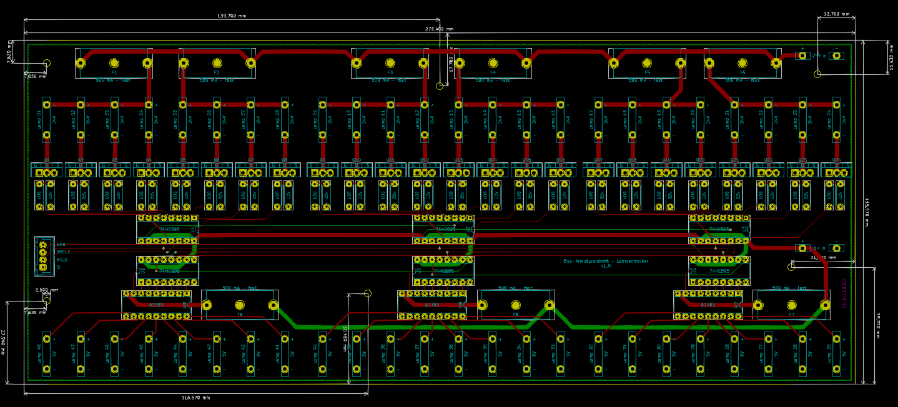
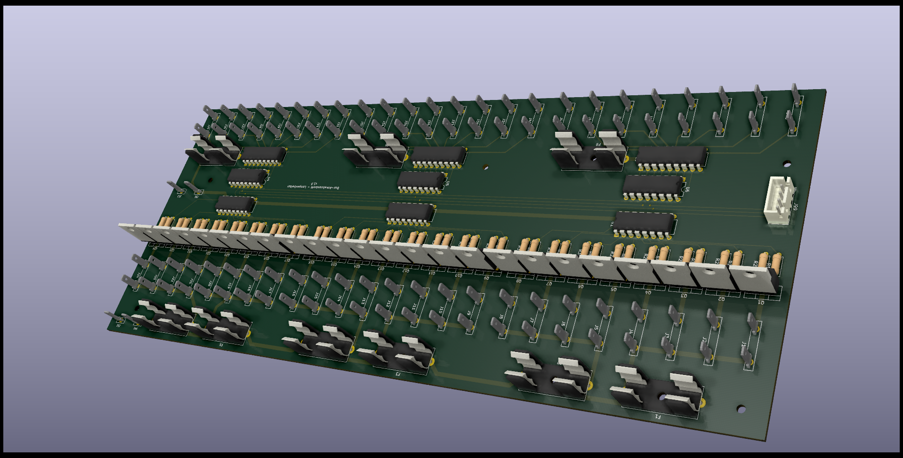

# The Lamp Driver PCB

The Lamp Driver PCB was created with [KiCAD](https://kicad-pcb.org/). The complete project is downloadable [here](files/LampDriver-Kicad.zip). I found the 3D data file for creating the blade terminal part in KICad on the [manufacturers website (vogtshop.ch)](https://www.vogtshop.ch/index.cfm?content=productData&Language=1&TreeID=BC533B35-D97E-46A2-872A-A3342E5C8212&sId=DEB33619-878B-4929-88BA-EDD863B07F05&sId=DEB33619-878B-4929-88BA-EDD863B07F05).

The Lamp Driver PCB mainly consist of three distinct parts:
- the controller part: six shift register ICs ([74hc595](https://microcontrollerslab.com/74hc595-shift-register-interfacing-arduino/)) controlling the two output parts (in the center of the schematics)
- the 5V output part: three driver ICs that deliver power to LEDs on the bus dashboard (on the bottom of the schematics)
- the 24V output part: 3x8 MOSFETs ([IRLZ44N](https://www.infineon.com/cms/en/product/power/mosfet/12v-300v-n-channel-power-mosfet/irlz44n/), a logic level MOSFET that conducts at low voltages) that control power to the switches etc. on the bus dashboard (on the top of the schematics)



Based on the schematics I have created an easy-to-solder PCB (THT instead of SMD):





To have the board produced by [JLCPCB](https://jlcpcb.com/) I have also [exported the board design to gerber format](files/LampDriverPCB_gerber.zip). The process is nicely [described on their website](https://support.jlcpcb.com/article/44-how-to-export-kicad-pcb-to-gerber-files).

## Some infos about the pcb
- Instead of soldering all those ICs directly onto the pcb you should use sockets.
- The board is pretty big. This is due to the fact that the connectors have a lot of space between them. Placing them closer to each other is possible but makes the assembly (or disassembly if necessary) more finicky.
- Testing the MOSFETs with a 24V light bulb has shown that there was no noticable warming, hence no effort was made for cooling. Should you want to drive more mA please consider a) placing the MOSFETs further apart to allow for heatsinks and b) increasing the trace width.
- The number of fuses might be overkill. I have experienced a smokey situation without them so I added a few (and probably a few more than necessary).
- The way I had to place the [74hc595](https://microcontrollerslab.com/74hc595-shift-register-interfacing-arduino/) ICs on the board has led to a not immediatly intuitive adressing order (which the code takes care of):

```
/*  24V side:
    Position:  0   1   2   3   4   5   6   7    8   9  10  11  12  13  14  15   16  17  18  19  20  21  22  23
    IC:        --------      1      -------- |  --------      2      -------- |  --------      3      --------
    IC-Pin:   QH  QG  QF  QE  QD  QC  QB  QA | QH  QG  QF  QE  QD  QC  QB  QA | QH  QG  QF  QE  QD  QC  QB  QA
    index:     --------      0      -------- |  --------      1      -------- |  --------      2      --------
    bitnum:    7   6   5   4   3   2   1   0 |  7   6   5   4   3   2   1   0 |  7   6   5   4   3   2   1   0 

    5V side:
    Position: 47  46  45  44  43  42  41  40   39  38  37  36  35  34  33  32   31  30  29  28  27  26  25  24
    IC:        --------      1      -------- |  --------      2      -------- |  --------      3      --------
    IC-Pin:   QA  QB  QC  QD  QE  QF  QG  QH | QA  QB  QC  QD  QE  QF  QG  QH | QA  QB  QC  QD  QE  QF  QG  QH
    index:     --------      5      -------- |  --------      4      -------- |  --------      3      --------
    bitnum:    0   1   2   3   4   5   6   7 |  0   1   2   3   4   5   6   7 |  0   1   2   3   4   5   6   7 
*/
```

## Bill of materials
- 24 MOSFET [IRLZ44N](https://www.infineon.com/cms/en/product/power/mosfet/12v-300v-n-channel-power-mosfet/irlz44n/)
- 24 100 Ω resistors
- 24 22k Ω resistors
-  6 IC sockets 16 pin
-  6 IC [74hc595](https://microcontrollerslab.com/74hc595-shift-register-interfacing-arduino/) shift registers
-  3 IC sockets 18 pin
-  3 IC [TBD62783APG](https://toshiba.semicon-storage.com/info/docget.jsp?did=35900) octal DMOS-FET arrays
- 52 [blade terminals](https://www.vogtshop.ch/index.cfm?content=productData&Language=1&TreeID=BC533B35-D97E-46A2-872A-A3342E5C8212&sId=DEB33619-878B-4929-88BA-EDD863B07F05&sId=DEB33619-878B-4929-88BA-EDD863B07F05) 2,8mm
-  9 fuse holders [RND 170-00187](https://www.reichelt.de/sicherungshalter-fuer-5-x-20-mm-250-v-10-a-beige-rnd-170-00187-p253172.html?CCOUNTRY=445&LANGUAGE=de) (I haven't found a manufacturer's site for this so I simply chose the reseller's)
-  9 fuses 500mA (f)
-  1 socket JST-XH-4A

## Improvements for a future version
- The drill holes for the blade terminals need to be a little wider (between 1.30 and 1.35mm). Currently the drill holes are 1.2mm wide, as the manufacturer recommends. The blade terminals do not align cleanly on the board but stick out a little.  Measuring the pin on the blade terminals (~1.38mm) indicates that it should still stick to the drill hole for easy soldering when the drill hole is 1.35mm wide. Needs some testing...
- More detail on the silk screen. Currently the silk screen is a mess because I was lazy / too eager to have the board created finally.
- In version 1.0 the [74hc595](https://microcontrollerslab.com/74hc595-shift-register-interfacing-arduino/) ICs are powered by the separate 5V power source rather than by the arduino. This is a design flaw because the ICs AND the lamps (both 5V and 24V) get powered up simultanously. The state of the 74hc595 is not defined at that very moment and there is no way to set all the [74hc595](https://microcontrollerslab.com/74hc595-shift-register-interfacing-arduino/) output pins to LOW. In effect that might lead to a brief flashing of at least some of the lamps. In a future version there will be a different design that powers the 74hc595 ICs via the arduino.

## Disclaimer
The files and information given here are for informational purposes only. They have worked for me but I do not give any guarantee that they will work for you. Use them at your own risk.

<p xmlns:dct="http://purl.org/dc/terms/" xmlns:cc="http://creativecommons.org/ns#" class="license-text">This work   is licensed under <a rel="license" href="https://creativecommons.org/licenses/by-sa/4.0">CC BY-SA 4.0</a></p>