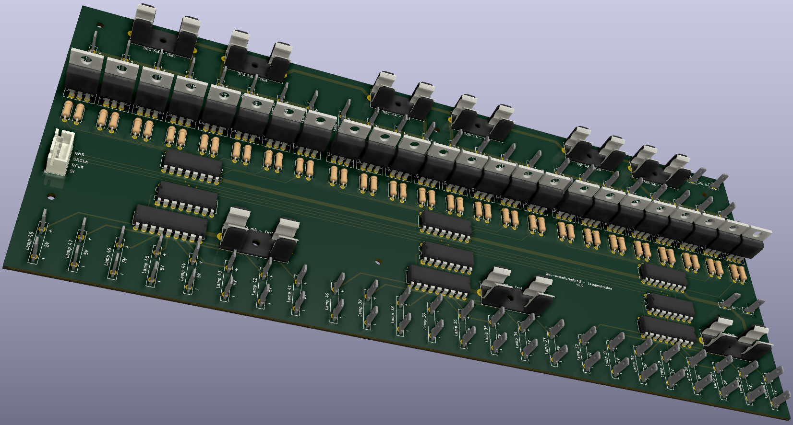

# The Lamp Driver PCB

The Lamp Driver PCB was created with KiCAD. The complete project is downloadable [here](files/LampDriver-Kicad.zip).

The Lamp Driver PCB mainly consist of three distinct parts:
- the controller part: six shift register ICs controlling the two output parts (in the center of the schematics)
- the 5V output part: three driver ICs that deliver power to LEDs on the bus dashboard (on the bottom of the schematics)
- the 24V output part: 3x8 MOSFETs that deliver power to the switches etc. on the bus dashboard (on the top of the schematics)

Based on the schematics I have created an easy-to-solder PCB (THT instead of SMD):

To have the board produced by [JLCPCB](https://jlcpcb.com/) I have also [exported the board design to gerber format](files/LampDriverPCB_gerber.zip).

Disclaimer: The files and information given here are for informational purposes only. They have worked for me but I do not give any guarantee that they will work for you. Use them at your own risk.
