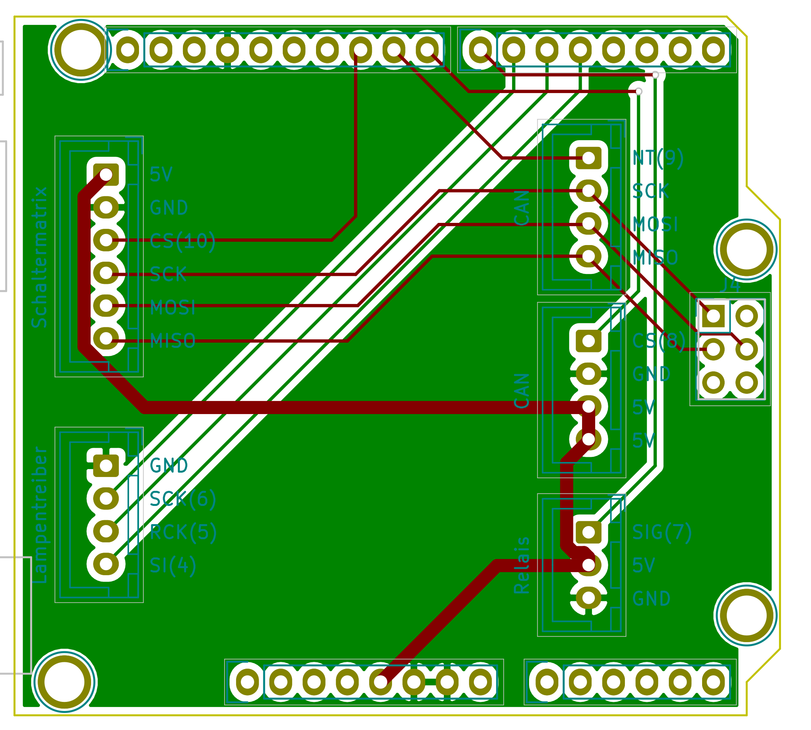
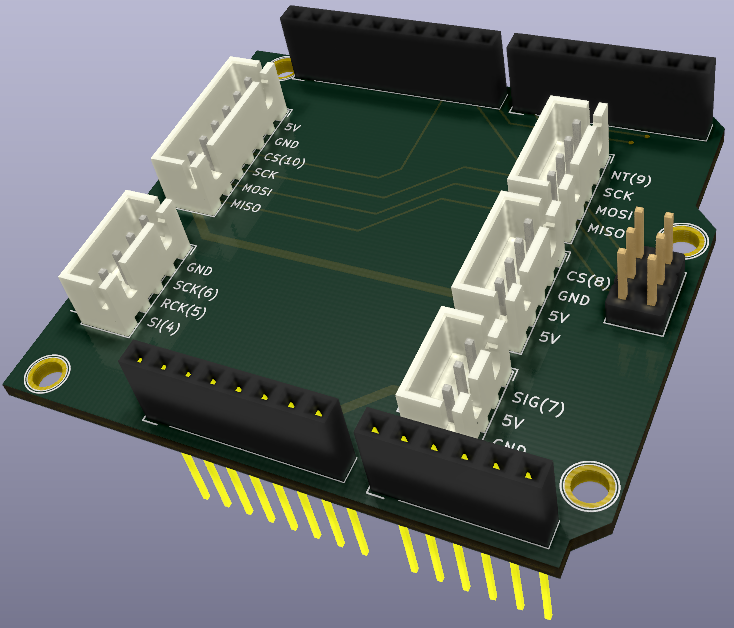

# The Distribution Shield PCB

The Distribution Shield PCB was created with [KiCAD](https://kicad-pcb.org/). The complete project is downloadable [here](files/Shield.zip).

Its only purpose is to provide sockets for the connection cables to the various other pcbs.

Based on the schematics I have created an easy-to-solder PCB (THT instead of SMD):

## Bill of materials
1 Socket  JST-XH3A (3x1)
2 Sockets JST-XH4A (4x1)
1 Socket  JST-XH6A (6x1)
1 Set Arduino stacking headers (female, including ICSP), consisting of
* 1 Dupont 1x6
* 2 Dupont 1x8
* 1 Dupont 1x10
* 1 Dupont 2*3 (ICSP)