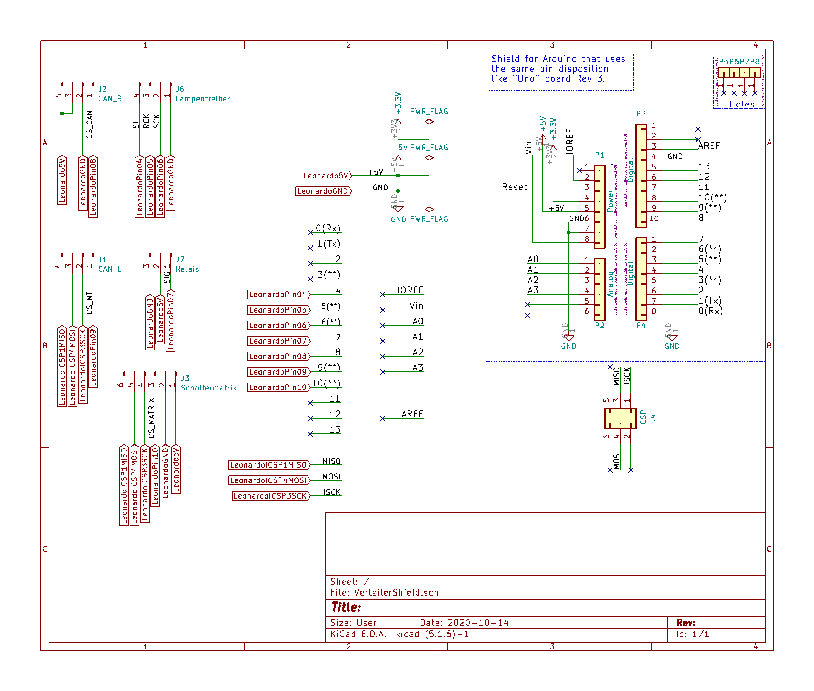

# The Distribution Shield PCB

The Distribution Shield PCB was created with [KiCAD](https://kicad-pcb.org/). The complete project is downloadable [here](files/Shield.zip).

Its only purpose is to provide sockets for the connection cables to the various other pcbs.

Based on the schematics I have created an easy-to-solder PCB (THT instead of SMD):

## Bill of materials

1 Socket  JST-XH3A (3x1)
2 Sockets JST-XH4A (4x1)
1 Socket  JST-XH6A (6x1)
1 Set Arduino stacking headers (female, including ICSP), consisting of

* 1 Dupont 1x6
* 2 Dupont 1x8
* 1 Dupont 1x10
* 1 Dupont 2*3 (ICSP)

The prototype was a separate board, not a shield. It can be seen in the picture of the complete prototype on the [overall documentation page](../documentation.md#a-first-prototype-of-the-controller).

The board pre-soldering:

Soldered and attached to the Arduino:
 

## How does it work?

It has no real funcionality besides routing the various arduino I/O-pins to socket pins.

## Things to take good care of

Double check the cabling you create. Neglecting this may lead to both unexpected and unwanted situations. Trust me.

## Improvements for a future version

- Swap VCC and GND pins on the connector to the [buttonmatrix pcb](../buttonmatrix/buttonmatrix.md). Alternative: swap VCC and GND there
- Add two pins to the socket that connects the lamp driver pcb: one for 5v from the Arduino Leonardo and another to be able to reset (switch everything of at once) the lamp driver pcb. Connecting the 5V from the Arduino will remove the design flaw described in the button matrix documentation.